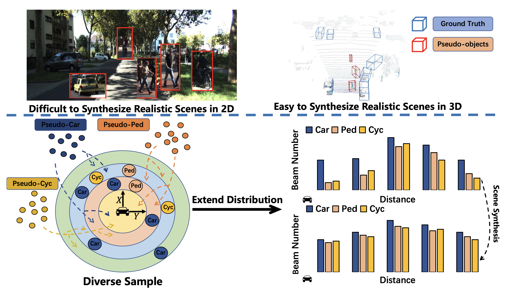
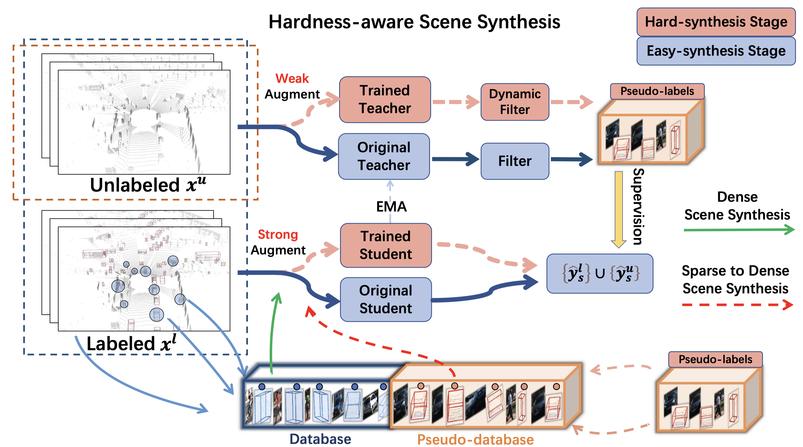
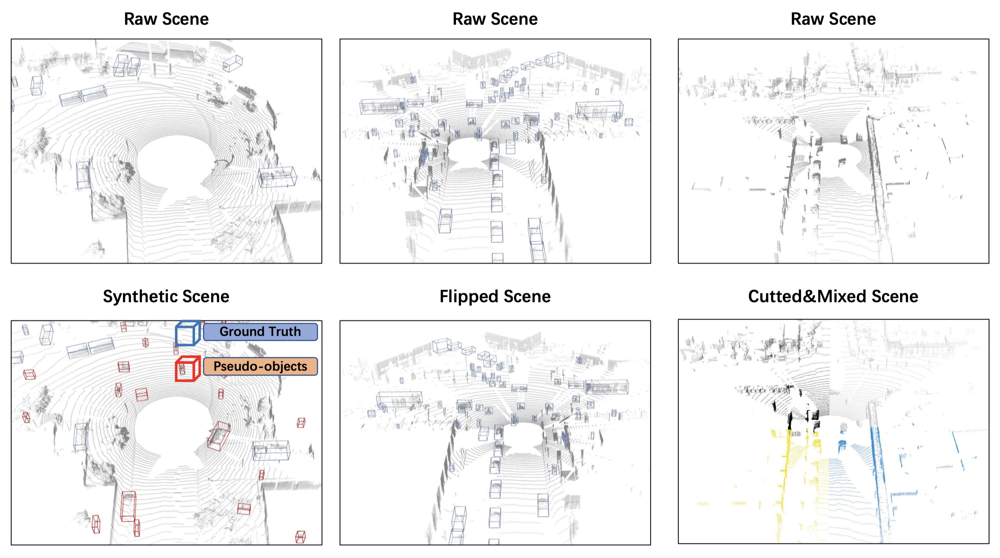

# Hardness-Aware Scene Synthesis for Semi-Supervised 3D Object Detection
### [Paper](https://arxiv.org/abs/2405.17422) 

> Hardness-Aware Scene Synthesis for Semi-Supervised 3DObject Detection

> [Shuai Zeng](https://github.com/shuaizg), [Wenzhao Zheng](https://wzzheng.net/)$\dagger$, [Jiwen Lu](http://ivg.au.tsinghua.edu.cn/Jiwen_Lu/), [Haibin Yan](https://scholar.google.com/citations?user=-AQLKlsAAAAJ)$\ddagger$

$\dagger$ Project leader $\ddagger$ Corresponding author

HASS proposes a scene synthesis strategy to adaptively generate challenging synthetic scenes for more generalizable semi-supervised 3D object detection.



## News
- **[2024/05/28]** Initial code release.
- **[2024/05/28]** Paper released on [arXiv](https://arxiv.org/abs/2405.17422).

## Overview



3D object detection aims to recover the 3D information of concerning objects and serves as the fundamental task of autonomous driving perception.
Its performance greatly depends on the scale of labeled training data, yet it is costly to obtain high-quality annotations for point cloud data.
While conventional methods focus on generating pseudo-labels for unlabeled samples as supplements for training, the structural nature of 3D point cloud data facilitates the composition of objects and backgrounds to synthesize realistic scenes.
Motivated by this, we propose a hardness-aware scene synthesis (HASS) method to generate adaptive synthetic scenes to improve the generalization of the detection models.
We obtain pseudo-labels for unlabeled objects and generate diverse scenes with different compositions of objects and backgrounds.
As the scene synthesis is sensitive to the quality of pseudo-labels, we further propose a hardness-aware strategy to reduce the effect of low-quality pseudo-labels and maintain a dynamic pseudo-database to ensure the diversity and quality of synthetic scenes.
Extensive experimental results on the widely used KITTI and Waymo datasets demonstrate the superiority of the proposed HASS method, which outperforms existing semi-supervised learning methods on 3D object detection.




## Getting Started
To be detailed.

Please refer to the installation instructions of [3DIoUMatch](https://github.com/yezhen17/3DIoUMatch-PVRCNN) for usage.

## Acknowledgments

Our code is based on [3DIoUMatch-PVRCNN](https://github.com/yezhen17/3DIoUMatch-PVRCNN).

## Citation

If you find this project helpful, please consider citing the following paper:
```
@article{zeng2024hardness,
  title={Hardness-Aware Scene Synthesis for Semi-Supervised 3D Object Detection},
  author={Zeng, Shuai and Zheng, Wenzhao and Lu, Jiwen and Yan, Haibin},
  journal={IEEE Transactions on Multimedia},
  year={2024}
}
```